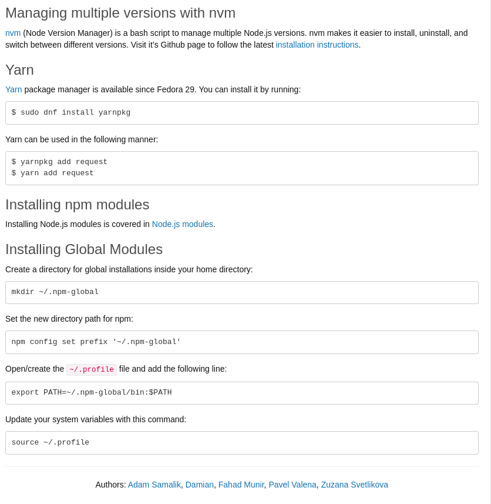

<!-- Heading -->

# Heading 1

## Heading 2

### Heading 3

#### Heading 4

##### Heading 5

###### Heading 6

---

<!-- Italics -->

_This text_ is italics

_This text_ is italics

---

<!-- Strong -->

**This text** is strong

**This text** is strong

---

<!-- Strike-Through -->

~~This text~~ is strike-through

---

<!-- Esacepe Character -->

\*This show the asterisk\*

\_This show the underscore\_

---

<!-- Block Quote -->

> This is a Block-quote

---

<!-- Links -->

[Google](www.google.com) <!-- This shows link as the tool tip -->

[Google](www.google.com "Google") <!-- This shows the text in double inverted commas as the tool tip -->

---

<!-- Unordered List -->

- Item 1
- Item 2
- Item 3
  - Nested UL
    - Nested UL

---

<!-- Ordered List -->

1. Item 1
2. Item 2
3. Item 3
   1. Nested Ordered List

---

<!-- In-line Code Block -->

`<p>Hello!</p>`

---

<!-- Image -->



---

<!-- Code Block -->

```
sudo dnf install code
```

```python
print("hello world")
```

---

<!-- Tables -->

| Name   | Email            |
| ------ | ---------------- |
| pranav | pranav@gmail.com |
| parag  | parag@gmail.com  |

---